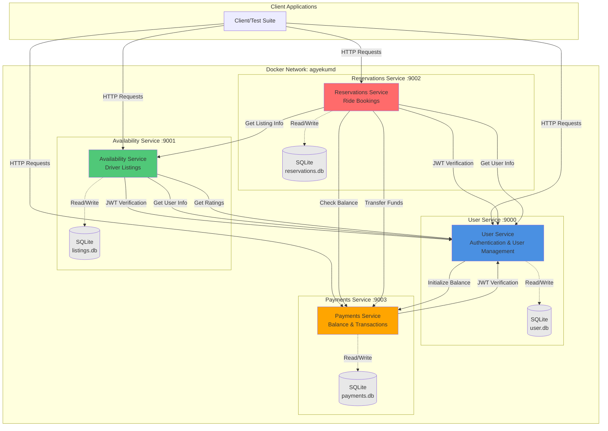
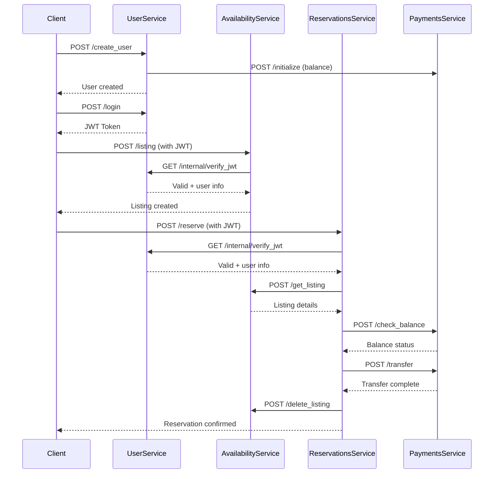

# Ride-Sharing Microservices Platform

A distributed microservices application for managing ride-sharing operations, built with Flask and Docker. This platform enables drivers to post availability listings and passengers to search, reserve, and pay for rides.

## 📋 Table of Contents

- [Overview](#overview)
- [Architecture](#architecture)
- [Services](#services)
- [Technology Stack](#technology-stack)
- [Prerequisites](#prerequisites)
- [Installation](#installation)
- [Usage](#usage)
- [API Endpoints](#api-endpoints)
- [Testing](#testing)
- [Project Structure](#project-structure)

## 🎯 Overview

This project implements a microservices architecture for a ride-sharing platform with four independent services:

- **User Service**: Manages user authentication, registration, and ratings
- **Availability Service**: Handles driver availability listings
- **Reservations Service**: Manages ride reservations between drivers and passengers
- **Payments Service**: Processes payments and manages user balances

All services communicate via REST APIs and are orchestrated using Docker Compose.

## 🏗️ Architecture

### System Architecture Diagram



### Communication Flow



## 🔧 Services

### 1. User Service (Port 9000)
**Responsibilities:**
- User registration and authentication
- JWT token generation and verification
- User rating management
- Internal endpoints for other services

**Key Features:**
- Password hashing using HMAC-SHA256
- JWT-based authentication
- User role management (driver/passenger)
- Rating system

### 2. Availability Service (Port 9001)
**Responsibilities:**
- Driver availability listing management
- Search functionality for passengers
- Listing availability status

**Key Features:**
- Create availability listings (drivers only)
- Search listings by day (passengers only)
- Automatic listing removal after reservation

### 3. Reservations Service (Port 9002)
**Responsibilities:**
- Ride reservation management
- Coordination between availability and payments
- Reservation viewing

**Key Features:**
- Create reservations (passengers only)
- Automatic payment processing
- View reservations for drivers and passengers

### 4. Payments Service (Port 9003)
**Responsibilities:**
- User balance management
- Payment processing
- Fund transfers between users

**Key Features:**
- Initialize user balances
- Add money to accounts
- Transfer funds (passenger → driver)
- Balance checking

## 💻 Technology Stack

- **Language**: Python 3
- **Framework**: Flask
- **Database**: SQLite
- **Containerization**: Docker & Docker Compose
- **Authentication**: JWT (JSON Web Tokens)
- **Cryptography**: HMAC-SHA256 for password hashing

## 📦 Prerequisites

- Docker (version 20.10 or higher)
- Docker Compose (version 2.0 or higher)
- Python 3.9+ (for running tests)
- `requests` library (for tests)

## 🚀 Installation

1. **Clone or navigate to the project directory:**
   ```bash
   cd agyekumd
   ```

2. **Build and start all services:**
   ```bash
   docker compose up -d --build
   ```

3. **Verify services are running:**
   ```bash
   docker compose ps
   ```

   You should see all four services running:
   - `user` on port 9000
   - `availability` on port 9001
   - `reservations` on port 9002
   - `payments` on port 9003

## 📖 Usage

### Starting Services

```bash
# Start all services
docker compose up -d

# View logs
docker compose logs -f

# Stop all services
docker compose down
```

### Example Workflow

1. **Create a user (driver):**
   ```bash
   curl -X POST http://localhost:9000/create_user \
     -d "first_name=John&last_name=Doe&username=jdoe&email_address=j@example.com&password=SecurePass123&driver=True&deposit=100.00&salt=randomsalt123"
   ```

2. **Login:**
   ```bash
   curl -X POST http://localhost:9000/login \
     -d "username=jdoe&password=SecurePass123"
   ```

3. **Create availability listing:**
   ```bash
   curl -X POST http://localhost:9001/listing \
     -H "Authorization: <JWT_TOKEN>" \
     -d "day=Monday&price=25.00&listingid=123"
   ```

4. **Search listings (as passenger):**
   ```bash
   curl -X GET "http://localhost:9001/search?day=Monday" \
     -H "Authorization: <JWT_TOKEN>"
   ```

5. **Make a reservation:**
   ```bash
   curl -X POST http://localhost:9002/reserve \
     -H "Authorization: <JWT_TOKEN>" \
     -d "listingid=123"
   ```

## 🔌 API Endpoints

### User Service (Port 9000)

| Method | Endpoint | Description | Auth Required |
|--------|----------|-------------|--------------|
| GET | `/clear` | Clear database | No |
| POST | `/create_user` | Register new user | No |
| POST | `/login` | Authenticate user | No |
| POST | `/rate` | Rate a user | Yes |
| POST | `/get_user_info` | Get user information | Internal |
| POST | `/get_rating` | Get user rating | Internal |
| GET | `/internal/verify_jwt` | Verify JWT token | Internal |

### Availability Service (Port 9001)

| Method | Endpoint | Description | Auth Required |
|--------|----------|-------------|--------------|
| GET | `/clear` | Clear database | No |
| POST | `/listing` | Create availability listing | Yes (Driver) |
| GET | `/search` | Search listings by day | Yes (Passenger) |
| POST | `/get_listing` | Get listing details | Internal |
| POST | `/delete_listing` | Mark listing as unavailable | Internal |

### Reservations Service (Port 9002)

| Method | Endpoint | Description | Auth Required |
|--------|----------|-------------|--------------|
| GET | `/clear` | Clear database | No |
| POST | `/reserve` | Create reservation | Yes (Passenger) |
| GET | `/view` | View latest reservation | Yes |
| POST | `/check_reservation` | Check if reservation exists | Internal |

### Payments Service (Port 9003)

| Method | Endpoint | Description | Auth Required |
|--------|----------|-------------|--------------|
| GET | `/clear` | Clear database | No |
| POST | `/initialize` | Initialize user balance | Internal |
| POST | `/add` | Add money to account | Yes |
| GET | `/view` | View account balance | Yes |
| POST | `/check_balance` | Check if user has enough balance | Internal |
| POST | `/transfer` | Transfer funds between users | Internal |

## 🧪 Testing

The project includes comprehensive test suites. To run all tests:

```bash
# From the project root directory
cd tests-updated

# Run individual tests
python3 test-login-regression-checkpoint.py
python3 test-create-availability-checkpoint.py
python3 test-view-availability.py
python3 test-make-reservation.py
python3 test-check-balance.py
python3 test-view-reservation.py

# Or run all tests
for test in test-*.py; do
    echo "Running $test..."
    python3 $test
done
```

### Expected Test Results

All tests should output: `Test Passed`

## 📁 Project Structure

```
agyekumd/
├── compose.yaml                 # Docker Compose configuration
├── key.txt                      # Secret key for JWT signing
├── README.md                    # This file
│
├── users/
│   ├── app.py                   # User service application
│   ├── Dockerfile.users         # User service Dockerfile
│   └── user.sql                 # User database schema
│
├── availability/
│   ├── app.py                   # Availability service application
│   ├── Dockerfile.availability  # Availability service Dockerfile
│   └── listings.sql             # Listings database schema
│
├── reservations/
│   ├── app.py                   # Reservations service application
│   ├── Dockerfile.reservations  # Reservations service Dockerfile
│   └── reservations.sql         # Reservations database schema
│
└── payments/
    ├── app.py                   # Payments service application
    ├── Dockerfile.payments      # Payments service Dockerfile
    └── payments.sql             # Payments database schema
```

## 🔐 Security Features

- **JWT Authentication**: All protected endpoints require valid JWT tokens
- **Password Hashing**: HMAC-SHA256 with salt for secure password storage
- **Service Isolation**: Each service has its own database and container
- **Centralized Auth**: Only the User Service holds the secret key for JWT verification
- **Role-Based Access**: Driver and passenger roles are enforced at the service level

## 🌐 Network Architecture

- **Network**: All services communicate via Docker bridge network `agyekumd`
- **Service Discovery**: Services use Docker service names (e.g., `user:5000`, `payments:5000`)
- **Port Mapping**: External ports 9000-9003 map to internal port 5000 for each service

## 📝 Notes

- All services use SQLite databases that are created automatically on first run
- The `/clear` endpoint resets the database for testing purposes
- JWT tokens are signed using the secret key in `key.txt`
- Services communicate internally using service names (e.g., `http://user:5000`)
- External clients connect via `localhost:9000-9003`

## 🤝 Contributing

This is a project submission. For questions or issues, please contact the project maintainer.

## 📄 License


---

**Built with ❤️ using Flask and Docker**

